<!-- Screenshot: white area only for your template. If export shows black background, try theme: gaia in front matter. -->

<!-- _backgroundColor: #ffffff -->

# Design Systems at Scale (Slide 1)

<div class="slide-content-area">

## Maintaining UI Consistency in Dynamic Plugin Architectures

**DevConf.IN 2026 · Track 4: User Experience and Design Engineering**

Mitesh Kumar · Red Hat Developer Hub

</div>

---

# What You'll Learn (Slide 2)

<div class="slide-content-area">

<div class="diagram-wrap">

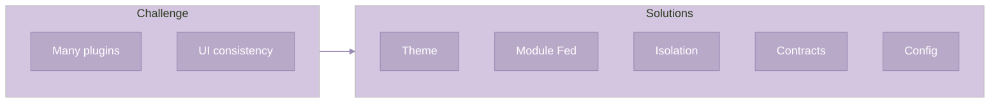

</div>

</div>

---

# What is Plugin Architectures? (Slide 3)

<div class="slide-content-area">

<div class="diagram-wrap">

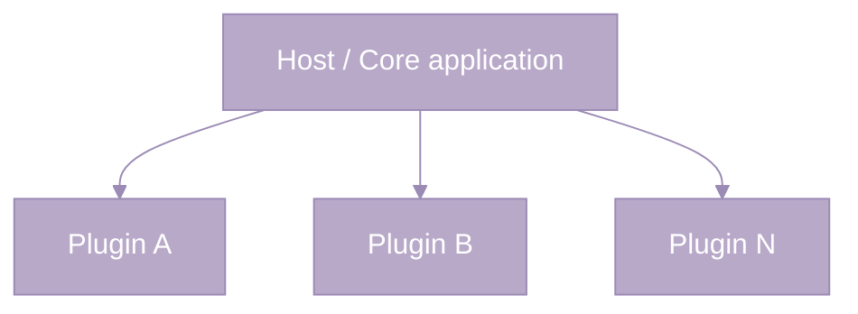

</div>

</div>

---

# Part 1: Why Plugin Architectures? (Slide 4)

<div class="slide-content-area">

<div class="two-diagrams">

<div>
<div class="diagram-label purple-text">Success stories</div>
<div class="diagram-wrap">

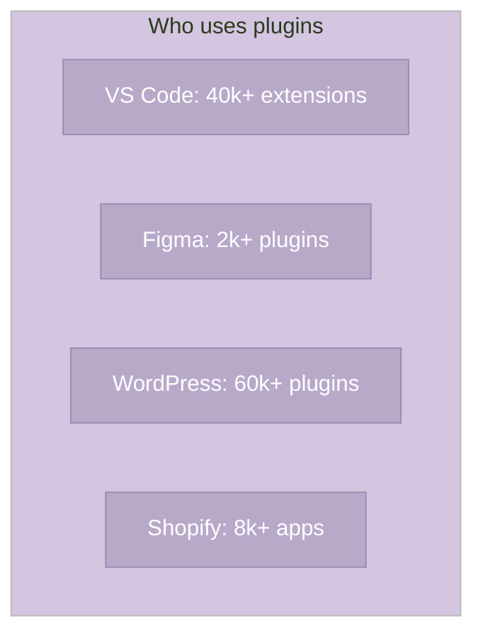

</div>
</div>

<div>
<div class="diagram-label purple-text">Why?</div>
<div class="diagram-wrap">

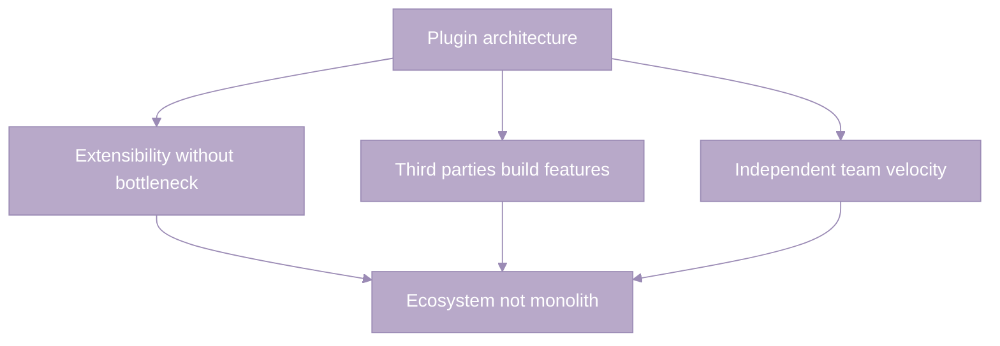

</div>
</div>

</div>

</div>

---

# The Consistency Problem (Slide 5)

<div class="slide-content-area">

<div class="two-diagrams">

<div>
<div class="diagram-label purple-text">What goes wrong</div>
<div class="diagram-wrap">

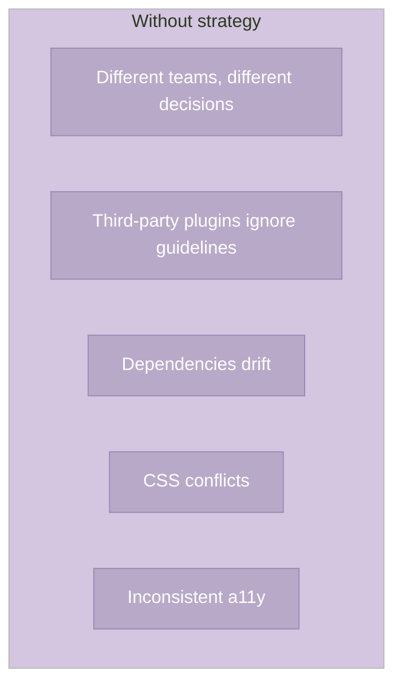

</div>
</div>

<div>
<div class="diagram-label purple-text">The cost</div>
<div class="diagram-wrap">

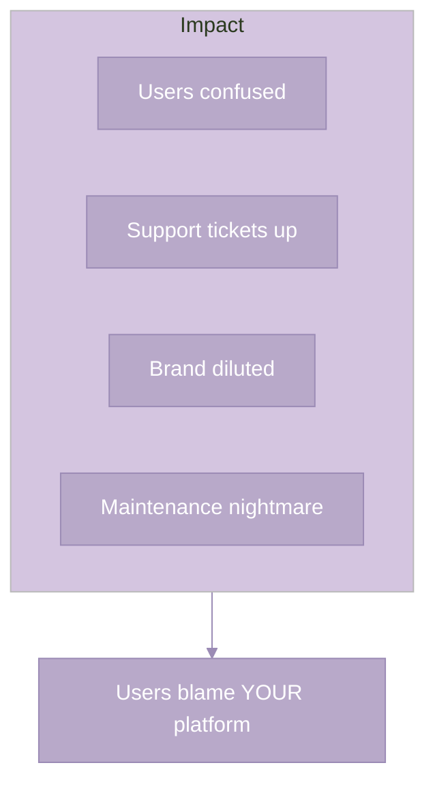

</div>
</div>

</div>

<div class="diagram-wrap" style="margin-top:0.5em">

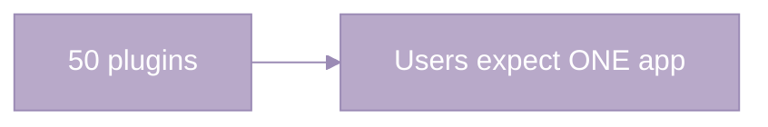

</div>

</div>

---

# Before vs After (Slide 6)

<div class="slide-content-area">

<div class="two-diagrams">

<div>
<div class="diagram-label purple-text">Without strategy</div>
<div class="diagram-wrap">

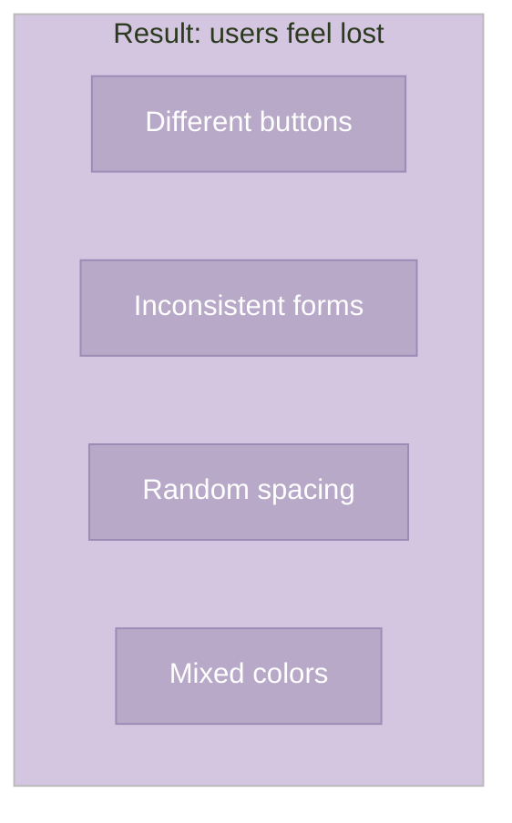

</div>
</div>

<div>
<div class="diagram-label purple-text">With strategy</div>
<div class="diagram-wrap">

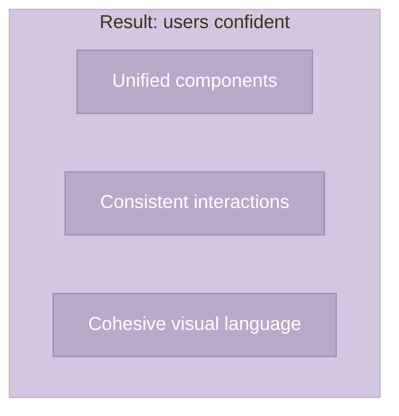

</div>
</div>

</div>

</div>

---

# Part 2: Five Strategies (Slide 7)

<div class="slide-content-area">

<div class="diagram-wrap">

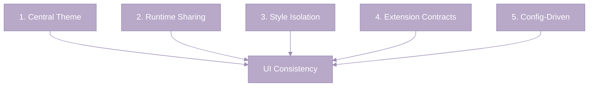

</div>

</div>

---

# Case Study Introduction (Slide 8)

<div class="slide-content-area">

<div class="two-diagrams">

<div>
<div class="diagram-label purple-text">What is RHDH</div>
<div class="diagram-wrap">

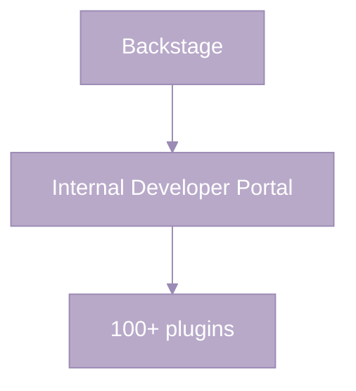

</div>
</div>

<div>
<div class="diagram-label purple-text">Plugin sources</div>
<div class="diagram-wrap">

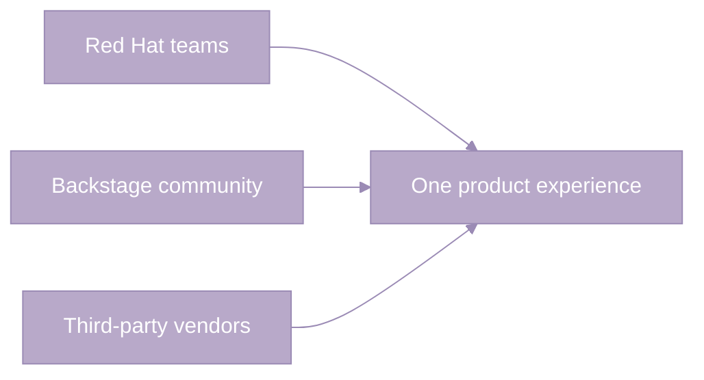

</div>
</div>

</div>

</div>

---

# Strategy 1: Central Theme System – The Principle (Slide 9)

<div class="slide-content-area">

<div class="diagram-wrap">

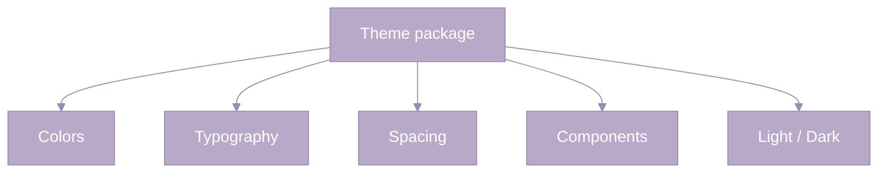

</div>

</div>

---

# Why Centralize (Slide 10)

<div class="slide-content-area">

<div class="two-diagrams">

<div>
<div class="diagram-label purple-text">Without central theme</div>
<div class="diagram-wrap">

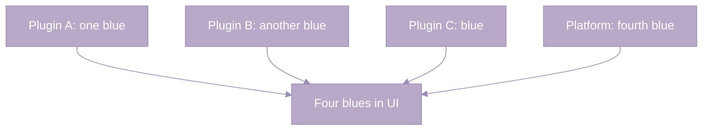

</div>
</div>

<div>
<div class="diagram-label purple-text">With central theme</div>
<div class="diagram-wrap">

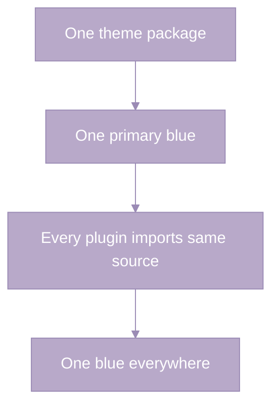

</div>
</div>

</div>

</div>

---

# Implementation Pattern (theme) (Slide 11)

<div class="slide-content-area">

<div class="two-diagrams">

<div>
<div class="diagram-label purple-text">Theme palette</div>
<div class="diagram-wrap">

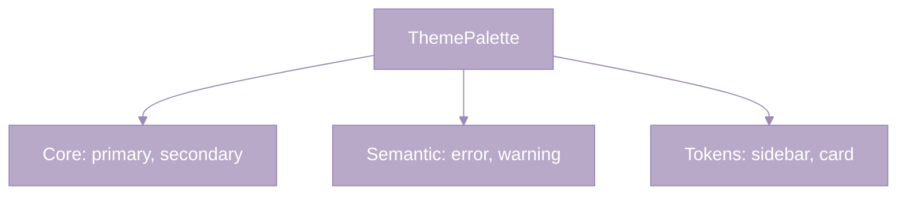

</div>
</div>

<div>
<div class="diagram-label purple-text">Aim</div>
<div class="diagram-wrap">

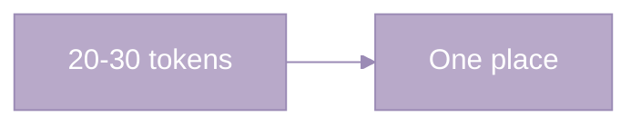

</div>
</div>

</div>

<div class="snippet-wrap" style="margin-top:0.5em;">interface ThemePalette { primary, secondary, sidebar, card... }</div>

</div>

---

# RHDH Example (theme) (Slide 12)

<div class="slide-content-area">

<div class="two-diagrams">

<div>
<div class="diagram-label purple-text">Theme plugin</div>
<div class="diagram-wrap">

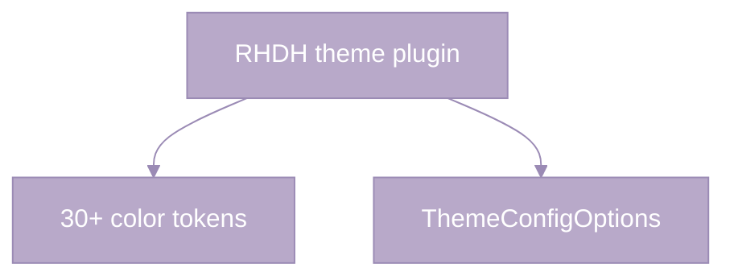

</div>
</div>

<div>
<div class="diagram-label purple-text">Per-component</div>
<div class="diagram-wrap">

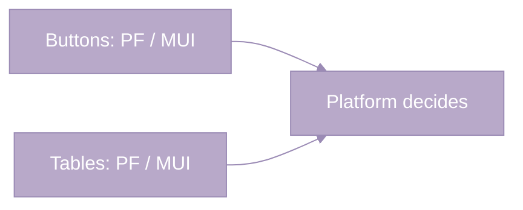

</div>
</div>

</div>

<div class="snippet-wrap" style="margin-top:0.5em;">useThemes() — central hook</div>

</div>

---

# Takeaway (theme) (Slide 13)

<div class="slide-content-area">

<div class="diagram-wrap">

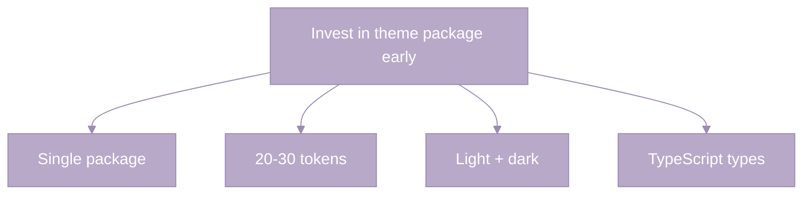

</div>

</div>

---

# Strategy 2: Runtime Dependency Sharing – The Problem with Bundling (Slide 14)

<div class="slide-content-area">

<div class="diagram-wrap">

```mermaid
%%{init: {'theme':'base', 'themeVariables': { 'primaryColor':'#B8A9C9', 'primaryTextColor':'#ffffff', 'primaryBorderColor':'#9B8BB5', 'lineColor':'#9B8BB5', 'secondaryColor':'#C4B5D4', 'tertiaryColor':'#D4C5E0'}}}%%
flowchart TB
  subgraph bad["Each bundles own React"]
    A[Plugin A React]
    B[Plugin B React]
    C[Plugin C React]
  end
  bad --> E[Invalid hook call]
  bad --> H[Huge bundles]
```

</div>

</div>

---

# The Solution (Module Federation) (Slide 15)

<div class="slide-content-area">

<div class="diagram-wrap">

```mermaid
%%{init: {'theme':'base', 'themeVariables': { 'primaryColor':'#B8A9C9', 'primaryTextColor':'#ffffff', 'primaryBorderColor':'#9B8BB5', 'lineColor':'#9B8BB5', 'secondaryColor':'#C4B5D4', 'tertiaryColor':'#D4C5E0'}}}%%
flowchart TB
  H[Host: React, ReactDOM, MUI, Router]
  H --> P1[Plugin A]
  H --> P2[Plugin B]
  H --> P3[Plugin C]
```

</div>

<div class="diagram-label purple-text" style="margin-top:0.5em;">Share at runtime, not build time</div>

</div>

---

# What to Share (Slide 16)

<div class="slide-content-area">

<table class="visual-table" style="width:100%;">
<tr><th>Share from host</th><th>Bundle per plugin</th></tr>
<tr><td>React, ReactDOM</td><td>Plugin-specific libs</td></tr>
<tr><td>UI library, Router</td><td>D3, Chart.js</td></tr>
<tr><td>State, core components</td><td>Heavy utilities</td></tr>
</table>

<div class="diagram-wrap" style="margin-top:0.5em">

```mermaid
%%{init: {'theme':'base', 'themeVariables': { 'primaryColor':'#B8A9C9', 'primaryTextColor':'#ffffff', 'primaryBorderColor':'#9B8BB5', 'lineColor':'#9B8BB5', 'secondaryColor':'#C4B5D4', 'tertiaryColor':'#D4C5E0'}}}%%
flowchart LR
  S[Singleton or 50%+ plugins] --> Share[Share]
```

</div>

</div>

---

# Implementation (Webpack Module Federation) (Slide 17)

<div class="slide-content-area">

<div class="diagram-wrap">

```mermaid
%%{init: {'theme':'base', 'themeVariables': { 'primaryColor':'#B8A9C9', 'primaryTextColor':'#ffffff', 'primaryBorderColor':'#9B8BB5', 'lineColor':'#9B8BB5', 'secondaryColor':'#C4B5D4', 'tertiaryColor':'#D4C5E0'}}}%%
flowchart TB
  W[Webpack ModuleFederationPlugin]
  W --> S[shared: react, react-dom]
  S --> Sing[singleton: true]
  S --> Ver[requiredVersion]
```

</div>

<div class="snippet-wrap" style="margin-top:0.5em;">ModuleFederationPlugin({ shared: { react: { singleton: true, requiredVersion: '^18.0.0' } } })</div>

</div>

---

# RHDH Scalprum (Slide 18)

<div class="slide-content-area">

<div class="diagram-wrap">

```mermaid
%%{init: {'theme':'base', 'themeVariables': { 'primaryColor':'#B8A9C9', 'primaryTextColor':'#ffffff', 'primaryBorderColor':'#9B8BB5', 'lineColor':'#9B8BB5', 'secondaryColor':'#C4B5D4', 'tertiaryColor':'#D4C5E0'}}}%%
flowchart LR
  S[Scalprum]
  S --> M[Wraps Module Federation]
  M --> API[Backend API loads scripts]
  API --> D[Update plugins without rebuild]
```

</div>

</div>

---

# Strategy 3: Style Isolation – The CSS Problem (Slide 19)

<div class="slide-content-area">

<div class="diagram-wrap">

```mermaid
%%{init: {'theme':'base', 'themeVariables': { 'primaryColor':'#B8A9C9', 'primaryTextColor':'#ffffff', 'primaryBorderColor':'#9B8BB5', 'lineColor':'#9B8BB5', 'secondaryColor':'#C4B5D4', 'tertiaryColor':'#D4C5E0'}}}%%
flowchart LR
  A[Plugin A .MuiButton]
  B[Plugin B .MuiButton]
  A -.-> X[Conflict]
  B -.-> X
  X --> W[Load order wins]
```

</div>

</div>

---

# Isolation Techniques (Slide 20)

<div class="slide-content-area">

<div class="two-diagrams">

<div>
<div class="diagram-label purple-text">Class prefix</div>
<div class="diagram-wrap">

```mermaid
%%{init: {'theme':'base', 'themeVariables': { 'primaryColor':'#B8A9C9', 'primaryTextColor':'#ffffff', 'primaryBorderColor':'#9B8BB5', 'lineColor':'#9B8BB5', 'secondaryColor':'#C4B5D4', 'tertiaryColor':'#D4C5E0'}}}%%
flowchart TB
  M[MUI ClassNameGenerator]
  M --> P[prefix]
  P --> R[.plugin-tekton-MuiButton-root]
```

</div>
</div>

<div>
<div class="diagram-label purple-text">Shadow DOM</div>
<div class="diagram-wrap">

```mermaid
%%{init: {'theme':'base', 'themeVariables': { 'primaryColor':'#B8A9C9', 'primaryTextColor':'#ffffff', 'primaryBorderColor':'#9B8BB5', 'lineColor':'#9B8BB5', 'secondaryColor':'#C4B5D4', 'tertiaryColor':'#D4C5E0'}}}%%
flowchart TB
  Sh[Shadow root]
  Sh --> Plugin[Plugin inside]
  Plugin --> No[Styles dont leak]
```

</div>
</div>

</div>

</div>

---

# More Techniques (Slide 21)

<div class="slide-content-area">

<div class="diagram-wrap">

```mermaid
%%{init: {'theme':'base', 'themeVariables': { 'primaryColor':'#B8A9C9', 'primaryTextColor':'#ffffff', 'primaryBorderColor':'#9B8BB5', 'lineColor':'#9B8BB5', 'secondaryColor':'#C4B5D4', 'tertiaryColor':'#D4C5E0'}}}%%
flowchart LR
  C[CSS Modules]
  B[BEM + prefix]
  R[RHDH: ClassNameGenerator]
  C & B & R --> I[14+ plugins]
```

</div>

</div>

---

# RHDH Wrapper Example (Slide 22)

<div class="slide-content-area">

<div class="two-diagrams">

<div>
<div class="diagram-label purple-text">Structure</div>
<div class="diagram-wrap">

```mermaid
%%{init: {'theme':'base', 'themeVariables': { 'primaryColor':'#B8A9C9', 'primaryTextColor':'#ffffff', 'primaryBorderColor':'#9B8BB5', 'lineColor':'#9B8BB5', 'secondaryColor':'#C4B5D4', 'tertiaryColor':'#D4C5E0'}}}%%
flowchart LR
  O[Original plugin]
  W[Wrapper]
  W --> O
  W --> R[Re-export]
```

</div>
</div>

<div>
<div class="diagram-label purple-text">No forking</div>
<div class="diagram-wrap">

```mermaid
%%{init: {'theme':'base', 'themeVariables': { 'primaryColor':'#B8A9C9', 'primaryTextColor':'#ffffff', 'primaryBorderColor':'#9B8BB5', 'lineColor':'#9B8BB5', 'secondaryColor':'#C4B5D4', 'tertiaryColor':'#D4C5E0'}}}%%
flowchart TB
  W[Wrapper]
  W --> C[Prefix]
  W --> E[Re-export unchanged]
```

</div>
</div>

</div>

<div class="snippet-wrap" style="margin-top:0.5em;">ClassNameGenerator.configure(name =&gt; `plugin-${name}`); export * from 'original-plugin';</div>

</div>

---

# Strategy 4: Extension Contracts – The Principle (Slide 23)

<div class="slide-content-area">

<div class="two-diagrams">

<div>
<div class="diagram-label purple-text">Without contracts</div>
<div class="diagram-wrap">

```mermaid
%%{init: {'theme':'base', 'themeVariables': { 'primaryColor':'#B8A9C9', 'primaryTextColor':'#ffffff', 'primaryBorderColor':'#9B8BB5', 'lineColor':'#9B8BB5', 'secondaryColor':'#C4B5D4', 'tertiaryColor':'#D4C5E0'}}}%%
flowchart TB
  N1[Plugins modify anything]
  N2[Breaking changes]
  N3[No predictable structure]
```

</div>
</div>

<div>
<div class="diagram-label purple-text">With contracts</div>
<div class="diagram-wrap">

```mermaid
%%{init: {'theme':'base', 'themeVariables': { 'primaryColor':'#B8A9C9', 'primaryTextColor':'#ffffff', 'primaryBorderColor':'#9B8BB5', 'lineColor':'#9B8BB5', 'secondaryColor':'#C4B5D4', 'tertiaryColor':'#D4C5E0'}}}%%
flowchart TB
  Y1[Defined extension points]
  Y2[Platform controls layout]
  Y3[Stable integration]
```

</div>
</div>

</div>

</div>

---

# Mount Points (Slide 24)

<div class="slide-content-area">

<div class="diagram-wrap">

```mermaid
%%{init: {'theme':'base', 'themeVariables': { 'primaryColor':'#B8A9C9', 'primaryTextColor':'#ffffff', 'primaryBorderColor':'#9B8BB5', 'lineColor':'#9B8BB5', 'secondaryColor':'#C4B5D4', 'tertiaryColor':'#D4C5E0'}}}%%
flowchart TB
  PL[Platform: slots]
  PL --> S1[page.header]
  PL --> S2[page.sidebar]
  PL --> S3[entity.overview]
  P1[Plugin A] --> S1
  P2[Plugin B] --> S3
```

</div>

<div class="diagram-label purple-text" style="margin-top:0.5em;">Platform controls structure. Plugins provide content.</div>

</div>

---

# More Extension Points (Slide 25)

<div class="slide-content-area">

<div class="two-diagrams">

<div>
<div class="diagram-label purple-text">Routes</div>
<div class="diagram-wrap">

```mermaid
%%{init: {'theme':'base', 'themeVariables': { 'primaryColor':'#B8A9C9', 'primaryTextColor':'#ffffff', 'primaryBorderColor':'#9B8BB5', 'lineColor':'#9B8BB5', 'secondaryColor':'#C4B5D4', 'tertiaryColor':'#D4C5E0'}}}%%
flowchart LR
  P[Path, component]
  P --> M[Menu item]
```

</div>
</div>

<div>
<div class="diagram-label purple-text">API extensions</div>
<div class="diagram-wrap">

```mermaid
%%{init: {'theme':'base', 'themeVariables': { 'primaryColor':'#B8A9C9', 'primaryTextColor':'#ffffff', 'primaryBorderColor':'#9B8BB5', 'lineColor':'#9B8BB5', 'secondaryColor':'#C4B5D4', 'tertiaryColor':'#D4C5E0'}}}%%
flowchart LR
  F[createApiFactory]
  F --> E[Extend platform APIs]
```

</div>
</div>

</div>

</div>

---

# TypeScript Enforcement (Slide 26)

<div class="slide-content-area">

<div class="diagram-wrap">

```mermaid
%%{init: {'theme':'base', 'themeVariables': { 'primaryColor':'#B8A9C9', 'primaryTextColor':'#ffffff', 'primaryBorderColor':'#9B8BB5', 'lineColor':'#9B8BB5', 'secondaryColor':'#C4B5D4', 'tertiaryColor':'#D4C5E0'}}}%%
flowchart TB
  I[MountPointComponent]
  I --> C[Component]
  I --> Config[layout, conditions]
  P[Plugin implements] --> I
  I --> T[TypeScript catches at build time]
```

</div>

</div>

---

# YAML Configuration (Slide 27)

<div class="slide-content-area">

<div class="diagram-wrap">

```mermaid
%%{init: {'theme':'base', 'themeVariables': { 'primaryColor':'#B8A9C9', 'primaryTextColor':'#ffffff', 'primaryBorderColor':'#9B8BB5', 'lineColor':'#9B8BB5', 'secondaryColor':'#C4B5D4', 'tertiaryColor':'#D4C5E0'}}}%%
flowchart LR
  Y[app-config.yaml]
  Y --> MP[mountPoints]
  Y --> R[dynamicRoutes]
  Y --> M[menuItem]
  MP & R & M --> O[No code, no rebuild]
```

</div>

<div class="diagram-label purple-text" style="margin-top:0.5em;">Ops manage plugins without developers</div>

</div>

---

# Strategy 5: Configuration-Driven – The Principle (Slide 28)

<div class="slide-content-area">

<div class="two-diagrams">

<div>
<div class="diagram-label purple-text">Code</div>
<div class="diagram-wrap">

```mermaid
%%{init: {'theme':'base', 'themeVariables': { 'primaryColor':'#B8A9C9', 'primaryTextColor':'#ffffff', 'primaryBorderColor':'#9B8BB5', 'lineColor':'#9B8BB5', 'secondaryColor':'#C4B5D4', 'tertiaryColor':'#D4C5E0'}}}%%
flowchart TB
  C[Code]
  C --> D[Devs, rebuild]
  C --> H[Hard A/B test]
```

</div>
</div>

<div>
<div class="diagram-label purple-text">Configuration</div>
<div class="diagram-wrap">

```mermaid
%%{init: {'theme':'base', 'themeVariables': { 'primaryColor':'#B8A9C9', 'primaryTextColor':'#ffffff', 'primaryBorderColor':'#9B8BB5', 'lineColor':'#9B8BB5', 'secondaryColor':'#C4B5D4', 'tertiaryColor':'#D4C5E0'}}}%%
flowchart TB
  Co[Config]
  Co --> O[Ops, runtime]
  Co --> E[Easy A/B test]
```

</div>
</div>

</div>

</div>

---

# What Should Be Configurable (Slide 29)

<div class="slide-content-area">

<div class="diagram-wrap">

```mermaid
%%{init: {'theme':'base', 'themeVariables': { 'primaryColor':'#B8A9C9', 'primaryTextColor':'#ffffff', 'primaryBorderColor':'#9B8BB5', 'lineColor':'#9B8BB5', 'secondaryColor':'#C4B5D4', 'tertiaryColor':'#D4C5E0'}}}%%
flowchart LR
  Y[YAML]
  Y --> L[Logos light/dark]
  Y --> Th[Theme colors]
  Y --> F[Feature flags]
```

</div>

<table class="visual-table" style="margin-top:0.5em;width:100%;">
<tr><th>Item</th><th>Example</th></tr>
<tr><td>Theme</td><td>primary, sidebar (light/dark)</td></tr>
<tr><td>Flags</td><td>darkMode, compactSidebar</td></tr>
</table>

</div>

---

# Theme Hooks (Slide 30)

<div class="slide-content-area">

<div class="diagram-wrap">

```mermaid
%%{init: {'theme':'base', 'themeVariables': { 'primaryColor':'#B8A9C9', 'primaryTextColor':'#ffffff', 'primaryBorderColor':'#9B8BB5', 'lineColor':'#9B8BB5', 'secondaryColor':'#C4B5D4', 'tertiaryColor':'#D4C5E0'}}}%%
flowchart TB
  H[useSidebarBackground]
  H --> T[useTheme]
  T --> C[Components]
  S[System theme] --> L[Light or dark]
```

</div>

</div>

---

# Putting It Together: Complete Architecture (Slide 31)

<div class="slide-content-area">

<div class="diagram-wrap">

```mermaid
%%{init: {'theme':'base', 'themeVariables': { 'primaryColor':'#B8A9C9', 'primaryTextColor':'#ffffff', 'primaryBorderColor':'#9B8BB5', 'lineColor':'#9B8BB5', 'secondaryColor':'#C4B5D4', 'tertiaryColor':'#D4C5E0'}}}%%
flowchart TB
  T[Theme package]
  M[Module Federation host]
  E[Extension point system]
  P[Plugins with wrappers]
  C[Configuration]
  T --> M --> E --> P --> C
```

</div>

</div>

---

# Wrapper Pattern (Slide 32)

<div class="slide-content-area">

<div class="two-diagrams">

<div>
<div class="diagram-label purple-text">Structure</div>
<div class="diagram-wrap">

```mermaid
%%{init: {'theme':'base', 'themeVariables': { 'primaryColor':'#B8A9C9', 'primaryTextColor':'#ffffff', 'primaryBorderColor':'#9B8BB5', 'lineColor':'#9B8BB5', 'secondaryColor':'#C4B5D4', 'tertiaryColor':'#D4C5E0'}}}%%
flowchart LR
  O[Original plugin]
  W[Wrapper]
  W --> O
  W --> R[Re-export]
```

</div>
</div>

<div>
<div class="diagram-label purple-text">What wrapper adds</div>
<div class="diagram-wrap">

```mermaid
%%{init: {'theme':'base', 'themeVariables': { 'primaryColor':'#B8A9C9', 'primaryTextColor':'#ffffff', 'primaryBorderColor':'#9B8BB5', 'lineColor':'#9B8BB5', 'secondaryColor':'#C4B5D4', 'tertiaryColor':'#D4C5E0'}}}%%
flowchart TB
  W[Wrapper]
  W --> C[ClassNameGenerator prefix]
  W --> E[Re-export unchanged]
  C --> I[CSS isolation]
  E --> N[No forking]
```

</div>
</div>

</div>

<div class="snippet-wrap" style="margin-top:0.5em;">package.json exports · index.ts isolation + re-export</div>

</div>

---

# Implementation Roadmap (Slide 33)

<div class="slide-content-area">

<div class="diagram-wrap">

```mermaid
%%{init: {'theme':'base', 'themeVariables': { 'primaryColor':'#B8A9C9', 'primaryTextColor':'#ffffff', 'primaryBorderColor':'#9B8BB5', 'lineColor':'#9B8BB5', 'secondaryColor':'#C4B5D4', 'tertiaryColor':'#D4C5E0'}}}%%
flowchart LR
  P1[Phase 1: Foundation]
  P2[Phase 2: Isolation]
  P3[Phase 3: Config]
  P4[Phase 4: Enforcement]
  P1 --> P2 --> P3 --> P4
```

</div>

<div class="diagram-label purple-text" style="margin-top:0.5em;">Theme, Module Fed, mount points → Isolation → YAML, hooks → TypeScript, lint</div>

</div>

---

# Common Pitfalls (Slide 34)

<div class="slide-content-area">

<div class="diagram-wrap">

```mermaid
%%{init: {'theme':'base', 'themeVariables': { 'primaryColor':'#B8A9C9', 'primaryTextColor':'#ffffff', 'primaryBorderColor':'#9B8BB5', 'lineColor':'#9B8BB5', 'secondaryColor':'#C4B5D4', 'tertiaryColor':'#D4C5E0'}}}%%
flowchart LR
  subgraph pit["Pitfall"]
    A[No theme]
    B[Bundle deps]
    C[No isolation]
  end
  subgraph sol["Solution"]
    X[Theme package]
    Y[Module Fed]
    Z[Prefix / Shadow]
  end
  A --> X
  B --> Y
  C --> Z
```

</div>

</div>

---

# Results: Metrics (Slide 35)

<div class="slide-content-area">

<table class="visual-table" style="width:100%;">
<tr><th></th><th>Before</th><th>After</th></tr>
<tr><td>Onboarding</td><td>2-3 wk</td><td>2-3 days</td></tr>
<tr><td>UI bugs/mo</td><td>~15</td><td>~2</td></tr>
<tr><td>Bundle (5 plugins)</td><td>2.8 MB</td><td>850 KB</td></tr>
<tr><td>Design reviews</td><td>4-5</td><td>1-2</td></tr>
<tr><td>Theme change</td><td>Days</td><td>Minutes</td></tr>
</table>

<div class="diagram-wrap" style="margin-top:0.5em">

```mermaid
%%{init: {'theme':'base', 'themeVariables': { 'primaryColor':'#B8A9C9', 'primaryTextColor':'#ffffff', 'primaryBorderColor':'#9B8BB5', 'lineColor':'#9B8BB5', 'secondaryColor':'#C4B5D4', 'tertiaryColor':'#D4C5E0'}}}%%
flowchart LR
  B[Before] --> A[After]
  A --> R[100+ plugins, consistent UX]
```

</div>

</div>

---

# Key Takeaways (Slide 36)

<div class="slide-content-area">

<div class="diagram-wrap">

```mermaid
%%{init: {'theme':'base', 'themeVariables': { 'primaryColor':'#B8A9C9', 'primaryTextColor':'#ffffff', 'primaryBorderColor':'#9B8BB5', 'lineColor':'#9B8BB5', 'secondaryColor':'#C4B5D4', 'tertiaryColor':'#D4C5E0'}}}%%
flowchart TB
  T1[1. Central theme early]
  T2[2. Module Federation]
  T3[3. Style isolation]
  T4[4. Extension contracts]
  T5[5. Config-driven]
  T1 & T2 & T3 & T4 & T5 --> K[Consistent plugin UI]
```

</div>

</div>

---

# Final Thought (Slide 37)

<div class="slide-content-area">

<div class="diagram-wrap">

```mermaid
%%{init: {'theme':'base', 'themeVariables': { 'primaryColor':'#B8A9C9', 'primaryTextColor':'#ffffff', 'primaryBorderColor':'#9B8BB5', 'lineColor':'#9B8BB5', 'secondaryColor':'#C4B5D4', 'tertiaryColor':'#D4C5E0'}}}%%
flowchart LR
  I[Invisible system]
  I --> U[One cohesive app]
  I --> D[Ship faster]
```

</div>

</div>

---

# Resources (Slide 38)

<div class="slide-content-area">

<div class="diagram-wrap">

```mermaid
%%{init: {'theme':'base', 'themeVariables': { 'primaryColor':'#B8A9C9', 'primaryTextColor':'#ffffff', 'primaryBorderColor':'#9B8BB5', 'lineColor':'#9B8BB5', 'secondaryColor':'#C4B5D4', 'tertiaryColor':'#D4C5E0'}}}%%
flowchart LR
  B[Backstage.io]
  R[RHDH GitHub]
  M[Module Federation]
  B & R & M --> More[Learn more]
```

</div>

</div>

---

# Thank You & Q&A (Slide 39)

<div class="slide-content-area">

## Questions?

**Mitesh Kumar** · Red Hat Developer Hub · @its-mitesh-kumar

</div>
